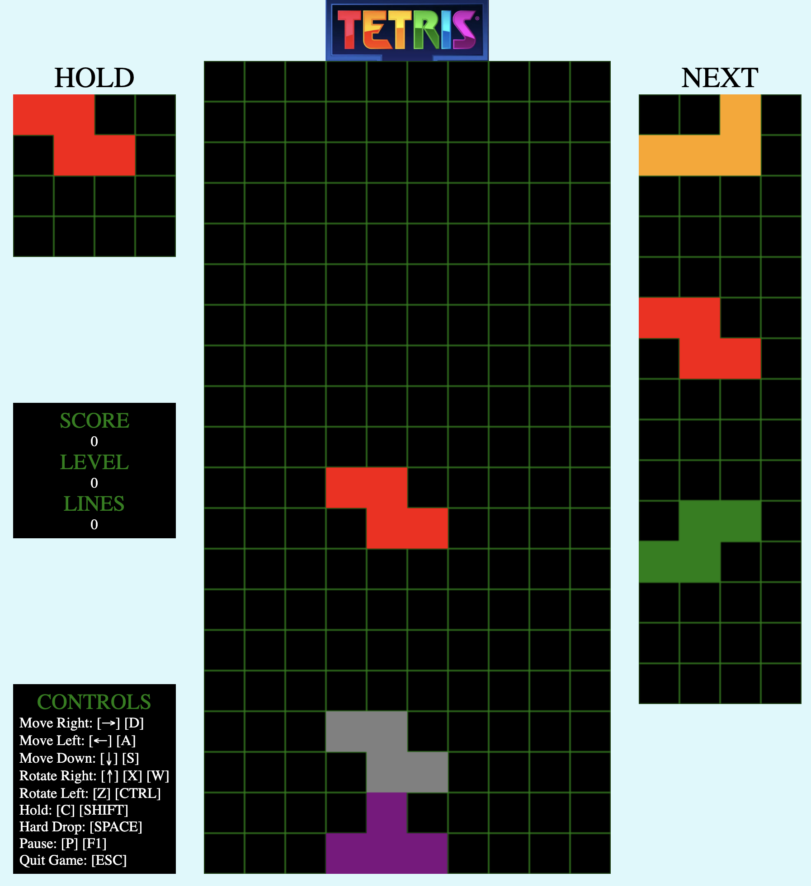
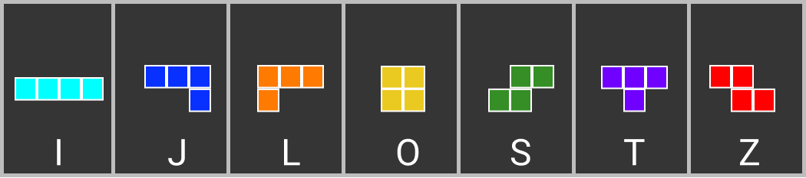
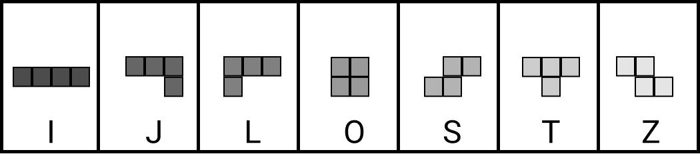
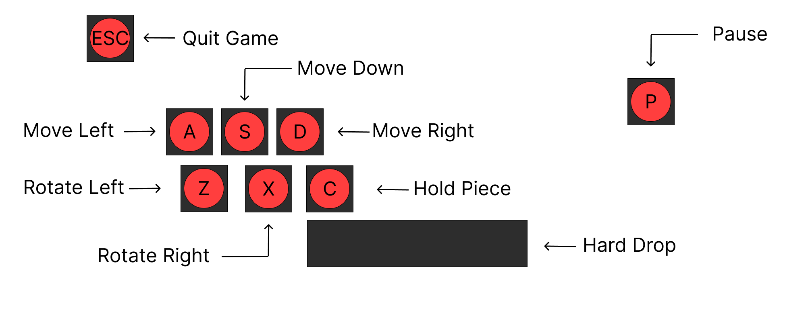

# My Tetris

Just plain old vanilla Javascript, CSS, and HTML to create tetris. 


## Types of Tetriminos
---
</br>

Multicolor


Monochrome


## Controls
---
</br>



## Game Rules
---
</br>

1. Clear lines by filling an entire row
2. Don't let the tetriminos overfill-- simple, right?

## Getting Started
---
```bash
npm install -g webpack webpack-cli
webpack
# Then paste dist/index.html's path into your browser!
```
</br>
